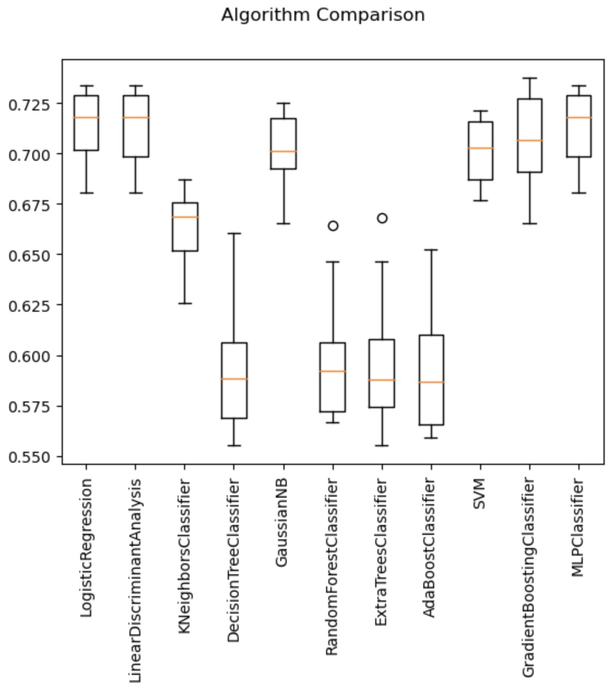

# Beating the Market with AI

Analysis of various machine learning models across two stocks to identify the best feature sets and models for real-world usage in finance. The goal of the project is to identify which model is best able to train and test on one stock while maintaining performance when tested on another stock.

---

## Technologies

This project leverages python with the following packages:

* [Pandas](https://github.com/pandas-dev/pandas) - For dataframes and date offsetting.

* [NumPy](https://github.com/numpy/numpy) - For mathematical functions.

* [Matplotlib](https://github.com/matplotlib/matplotlib) - For plotting and plot configuration.

* [Scikit-learn](https://github.com/scikit-learn/scikit-learn) - For preprocessing and various models.

* [TA Lib](https://github.com/mrjbq7/ta-lib) - For technical indicators.

---

## Installation Guide

Before first running the application install the following dependencies:

```python
    pip install pandas
    pip install numpy
    pip install matplotlib
    pip install scikit-learn
    pip install ta-lib
```

Jupyter may be required to view the .ipynb file.

```python
    pip install jupyter
```

---

## Usage

This project is primarily intended for analysis in order to identify ideal machine learning models for algorithmic trading purposes. The code can be modified to work with other data if needed. The ideal usage of this project would be using the final results and analysis to determine the ideal model for other projects and real-world applications. To use this project, ensure all packages are installed and run all to view the results and analysis.

The result of testing multiple models with the initial data as well as the box plot of the results can be seen below:

* LogisticRegression: 0.713262 (0.018495)

* LinearDiscriminantAnalysis: 0.712880 (0.018832)

* KNeighborsClassifier: 0.663751 (0.017812)

* DecisionTreeClassifier: 0.595224 (0.032750)

* GaussianNB: 0.700695 (0.018807)

* RandomForestClassifier: 0.598266 (0.031925)

* ExtraTreesClassifier: 0.597890 (0.033889)

* AdaBoostClassifier: 0.593313 (0.032291)

* SVM: 0.701454 (0.015199)

* GradientBoostingClassifier: 0.706790 (0.022231)

* MLPClassifier: 0.712880 (0.018832)



---

## Contributors

Brought to you by:
* [Jason](https://github.com/jasonbucks)
* [Justin](https://github.com/jlesieur0)
* [Majid](https://github.com/MajidKouki)
* [Ragini](https://github.com/ragininegi)
* [Souk](https://github.com/SoukP1)

---

## License

[](https://opensource.org/licenses/MIT)